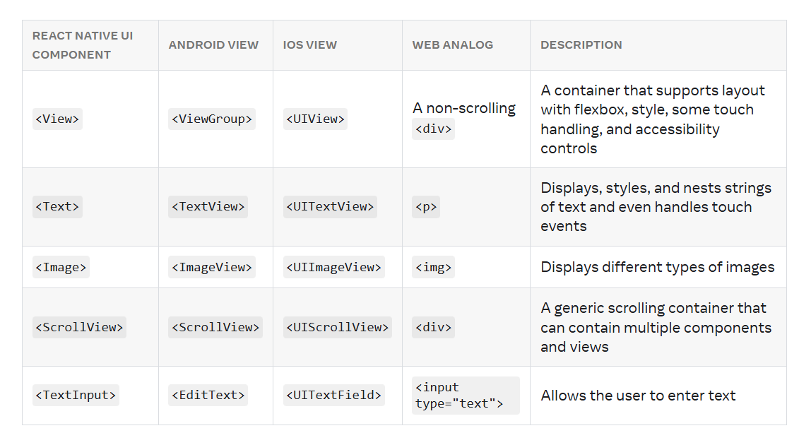

# React Native Notes

I'm new to react native so I'm going to see what they have to offer at <https://reactnative.dev/>  
😁👍

## Views and mobile development

In Android and iOS development, a view is the basic building block of UI: a small rectangular element on the screen which can be used to display text, images, or respond to user input. Even the smallest visual elements of an app, like a line of text or a button, are kinds of views. Some kinds of views can contain other views.

## Native Components

In Android development, you write views in Kotlin or Java; in iOS development, you use Swift or Objective-C. With React Native, you can invoke these views with JavaScript using React components. At runtime, React Native creates the corresponding Android and iOS views for those components. Because React Native components are backed by the same views as Android and iOS, React Native apps look, feel, and perform like any other apps. We call these platform-backed components Native Components.

## Core Components

React Native has many Core Components for everything from controls to activity indicators. You can find them all [documented in the API](https://reactnative.dev/docs/components-and-apis) section. You will mostly work with the following Core Components:

## React Fundamentals

Core concepts behind React:  

- Components - You can think of components as blueprints. Whatever a function component returns is rendered as a React element. React elements let you describe what you want to see on the screen
- JSX - React and React Native use JSX, a syntax that lets you write elements inside JavaScript
- [props](https://github.com/your-username/your-repo/blob/main/The%20Basics/03-ReactFundamentals.tsx#L98)

- state

### Useful Links

- [React Native](https://reactnative.dev/docs/getting-started)
- [React](https://react.dev/learn)
- [Expo](https://expo.dev/)
- [JavaScript Module Cheatsheet](https://medium.com/dailyjs/javascript-module-cheatsheet-7bd474f1d829)
- [Guide to JSX](https://react.dev/learn/writing-markup-with-jsx)
